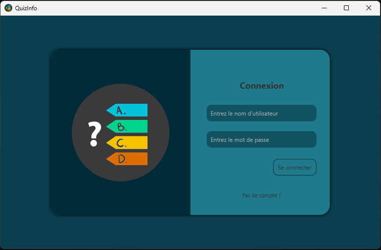
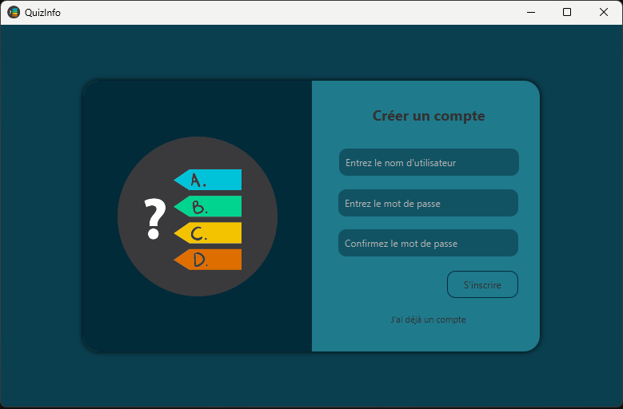

# Quiz Programmation avec JavaFX

Ce projet est une application de quiz sur la programmation développée en utilisant JavaFX. Les utilisateurs peuvent tester leurs connaissances en répondant à des questions liées à différents langages de programmation, concepts et paradigmes.

## Fonctionnalités

- Interface utilisateur conviviale développée avec JavaFX.
- Questions variées sur la programmation, couvrant divers langages et concepts.
- Possibilité de suivre les scores et voir les résultats à la fin du quiz.

## Captures d'écran

###### Page de connexion

###### Page d'inscription


## Comment utiliser

1. Assurez-vous d'avoir Java installé sur votre machine.
2. Téléchargez la dernière version de l'application depuis la section "Releases" sur GitHub.
3. Exécutez le fichier JAR pour lancer l'application.
4. Commencez le quiz, répondez aux questions et découvrez votre score à la fin.

## Développement

### Prérequis 

- Java JDK (version 20)

### Cloner le projet

```bash
git clone https://github.com/siradio7/quiz_javafx_mongodb.git
cd quiz_javafx_mongodb
